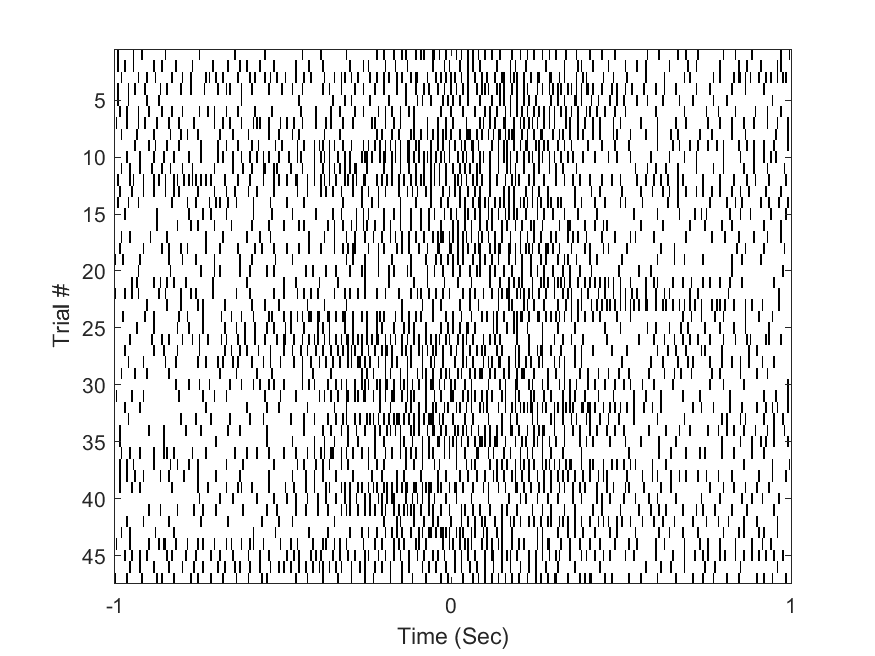
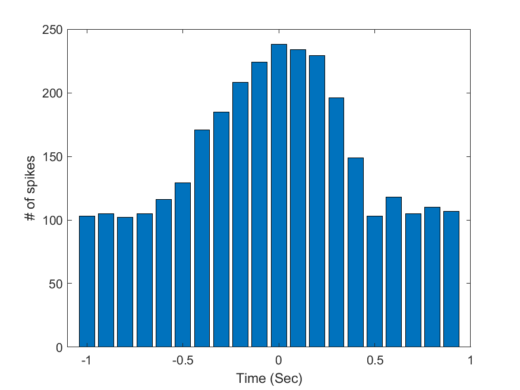
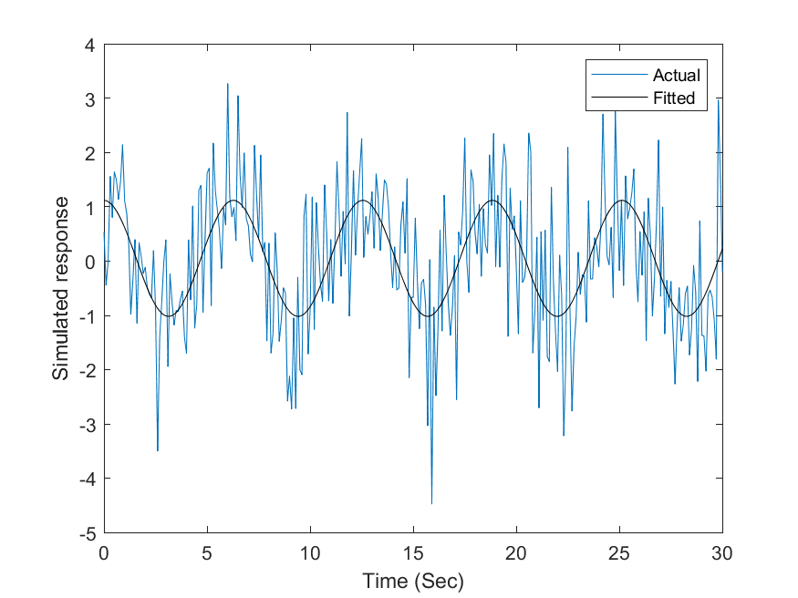
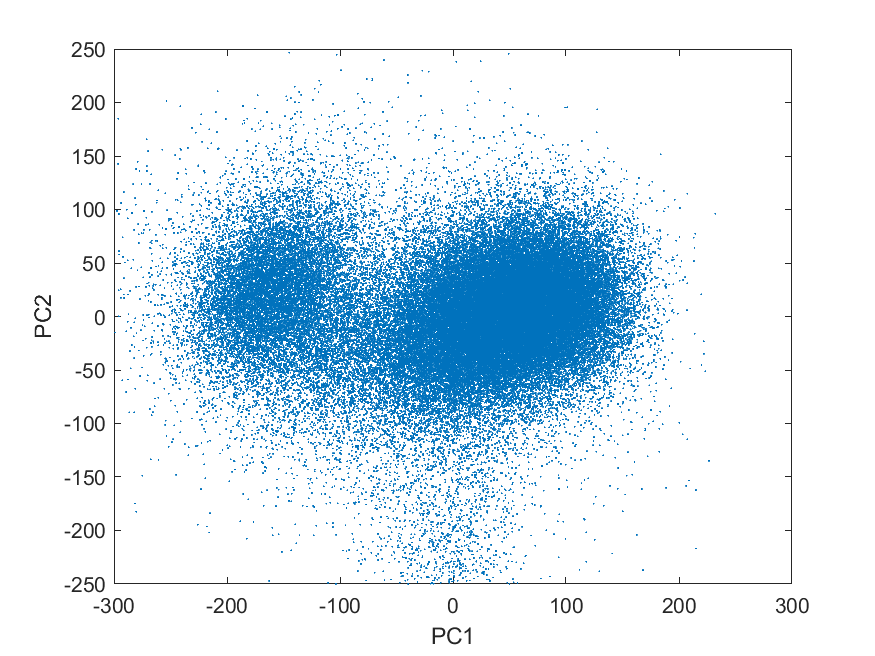
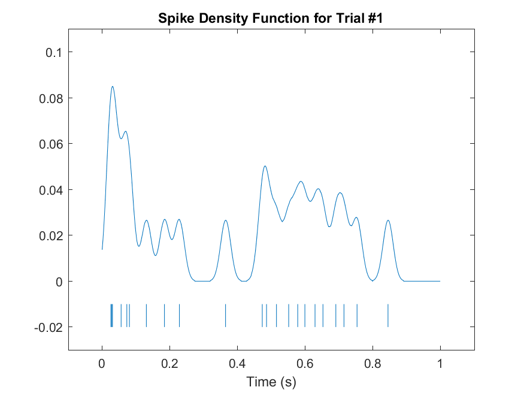
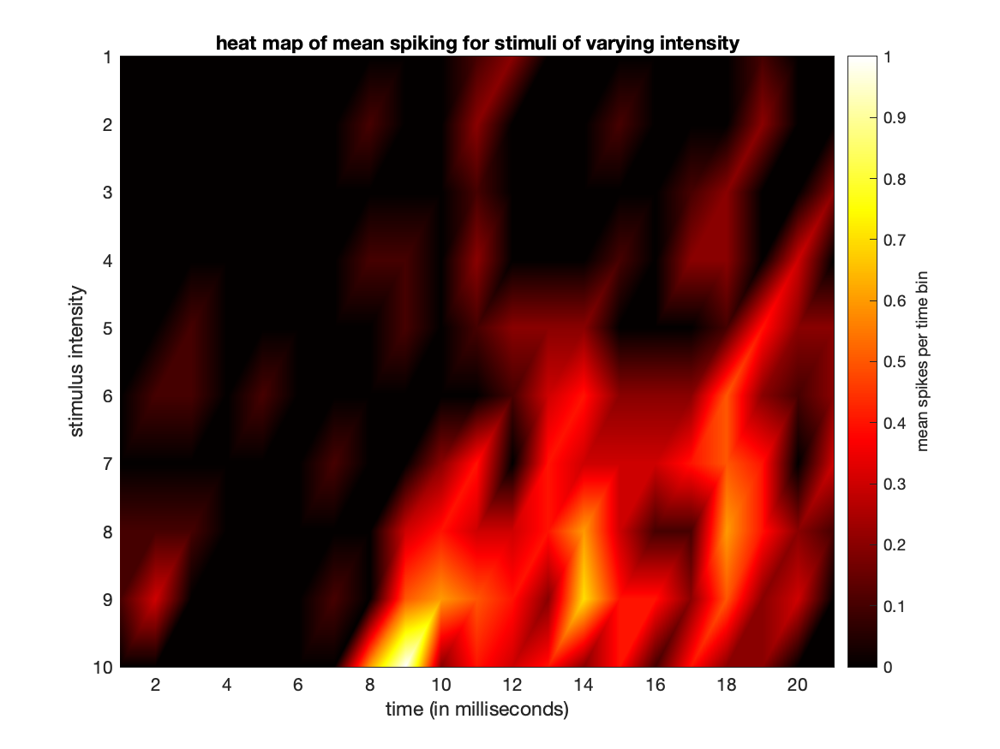
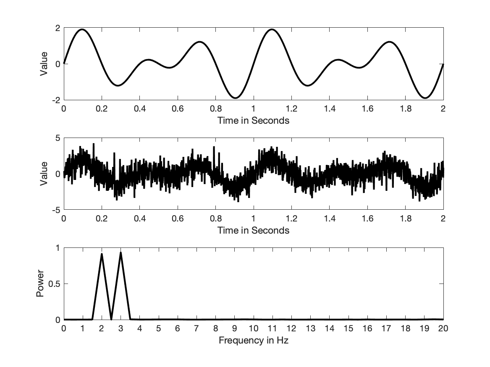

# CompNeuroMatlab
Computational neuroscience examples with MATLAB/GNU Octave.

## List of examples

### Raster plot



### Peri-Event Time Histogram (PETH)



### Curve Fitting



### PCA



### Spike Density Function



### Entropy

```
Table 1: Observed counts of stimulus-response pairs for the sample neuron
    21    28     2     1     1     8    33    17
     7     5    23    20    17    29     9     6
     1     0    21    26    27     7     1     5

Table 2: Joint probability distribution P(S,R) for the sample neuron
    0.0667    0.0889    0.0063    0.0032    0.0032    0.0254    0.1048    0.0540
    0.0222    0.0159    0.0730    0.0635    0.0540    0.0921    0.0286    0.0190
    0.0032         0    0.0667    0.0825    0.0857    0.0222    0.0032    0.0159

Entropy of stimulus S
    2.9729

Mutual information
    0.4996
```

### Heat map of mean spiking for various intensity stimuli



### Fast Fourier Transform (FFT)


